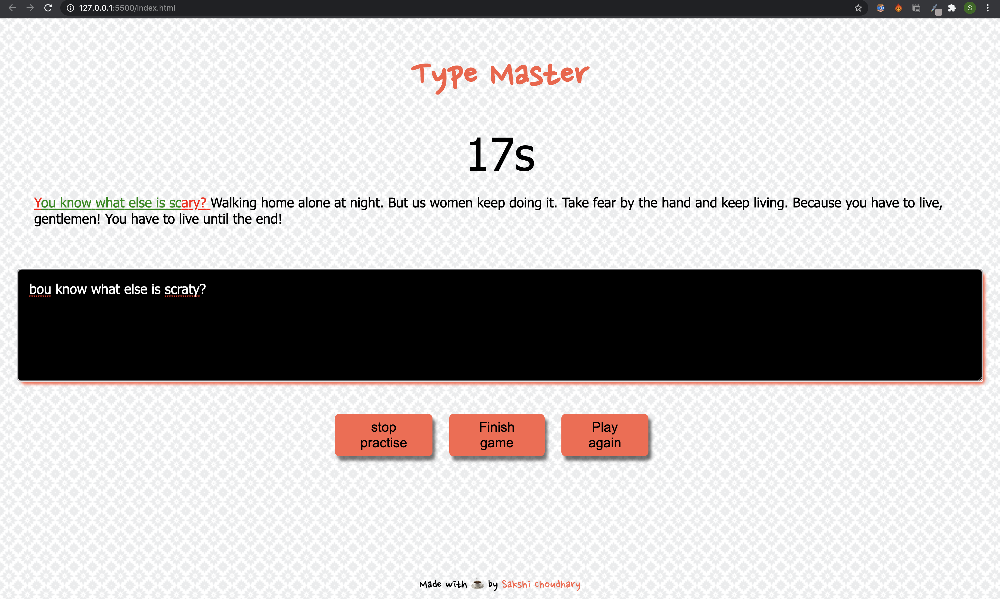

<h2 align="center">Type Master</h2>
	<h4 align="center">Type master is an application where user can type the given text in a limited amount of time and at last can check their no. of errors and accuracy %.<h4>

---

## Preview

---

## Instructions to run

- Clone it on your local machine and run index.html
- Or LIVE AT : <a href="http://www.sakshichoudhary.me/Type-Master/">CLICK HERE</a>

---

## Functionalities

- [x] User can see the time interval words must be typed in displayed in the app window
- [x] User can click on the 'Stop Practice' button to stop the practice session
- [x] User is prompted if an incorrect letter is entered
- [x] User can Resume after he stops
- [x] User can click on the 'play again' button during a game or after it finishes
- [x] User can check their errors and accuracy % at the end
- [x] User can see correct letter he typed in green and incorrect in red during the game.
- [ ] User can set the difficulty level

---

	Made with :heart: by <a href="http://sakshichoudhary.me">Sakshi Choudhary</a>

